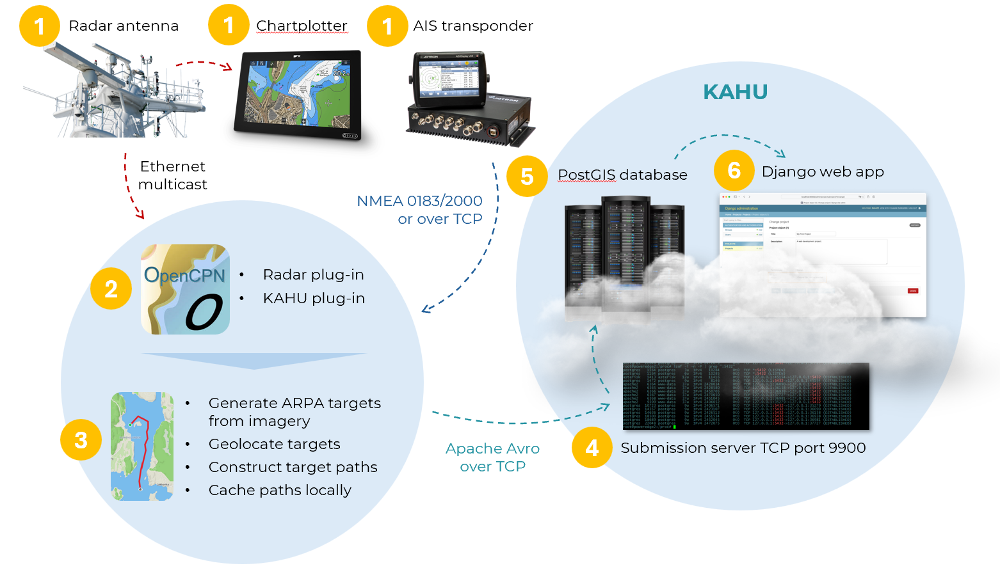
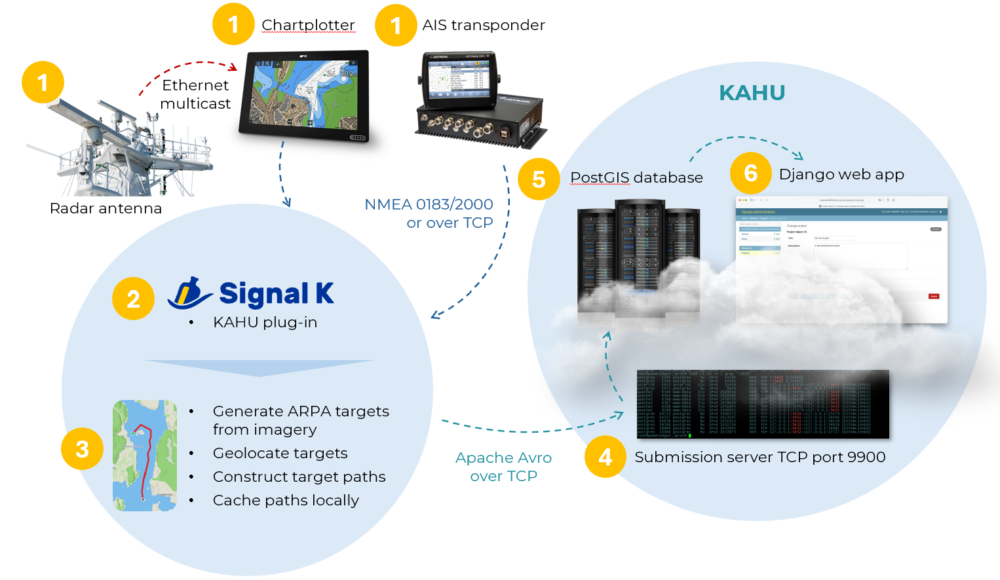

# Technical overview of KAHU platform

The following overview describes our onboard and cloud systems, and
how they interact with each other and with other onboard systems.

Before we get into the details, here are some general notes about
the onboard systems and their security design:

* The onboard software **receives data** from various **navigation systems**
  (over NMEA and/or Ethernet), but **never sends** nor produces any data
  for them.

  * For NMEA 0183 connections, we recommend to only connect the **RX (receive) wires** for extra security.

* The onboard software connects to and **sends data** to our **cloud
  service**, but **cannot receive** data, commands, or connections from the cloud.

* All onboard software is **open source**, allowing for independent verification by users or third parties.

  * We provide a [minimal open-source server implementation](https://github.com/KAHU-radar/radarhub-opencpn/tree/master/server) for testing onboard software in isolation (without requiring cloud connectivity).

# Onboard system

There are currently two possible onboard set-ups, depending on whether your radar is one of the [OpenCPN supported
models](https://github.com/opencpn-radar-pi/radar_pi/wiki).

## 1. OpenCPN set-up

This set up is for vessels with a [supported
radar](https://github.com/opencpn-radar-pi/radar_pi/wiki).

This solution uses and integrates with [OpenCPN](https://opencpn.org),
an open-source chart plotter with a radar plotter plugin.

* Connectivity:
  * OpenCPN connects to the radar antenna unit via Ethernet.
  * It also connects to AIS and heading sensors via NMEA (0183 or 2000 via USB adapter or over TCP).

* Data processing:
  * Radar imagery is received via multicast over Ethernet using the OpenCPN Radar plugin, which generates ARPA targets.
  * These targets are processed by the [KAHU Radar Hub plugin](https://github.com/KAHU-radar/radarhub-opencpn), which geolocates target positions using heading and position data from NMEA.

* Path generation and upload:
  * Consecutive ARPA target locations are combined into a path.
  * The path is uploaded to the cloud using an efficient [Apache Avro](https://avro.apache.org/)-based [protocol](https://github.com/KAHU-radar/radarhub-opencpn/blob/master/data/proto_avro.json).
  * If the internet is unavailable, paths are cached locally in an [sqlite database](https://sqlite.org/) until connectivity is restored.

## 2. Signal K set-up

This setup supports any radar model that can stream ARPA targets over NMEA ($RATTM messages).

* Core technology:
  * Uses [Signal K](https://signalk.org/), an open-source onboard marine data hub.
  * Signal K provides flexibility by supporting various onboard systems and proprietary protocols through its plugins.

* Data processing:
  * The radar identifies and transmits ARPA targets via NMEA 0183 or NMEA 2000 - either over their
respective standard cabling or TCP.
  * Signal K connects to the radar NMEA stream as well as heading and position streams from AIS and heading sensor.
  * The received ARPA target messages ($RATTM) are processed by the [KAHU Radar Hub plugin](https://github.com/KAHU-radar/radarhub-signalk), which geolocates the target positions using position and heading information received via NMEA.

* Path generation and upload:
  * Consecutive locations for the same ARPA target are strung together into a path, and this path uploaded to our cloud using an efficient [Apache Avro](https://avro.apache.org/) based [protocol](https://github.com/KAHU-radar/radarhub-opencpn/blob/master/data/proto_avro.json).
  * If the internet is unavailable, paths are cached locally in an [sqlite database](https://sqlite.org/) until connectivity is restored.

* Note:
  * The primary limitation of this setup is that only ARPA targets generated by the radar are detected, which may limit detection based on radar configuration.

# Cloud-based KAHU platform

The KAHU cloud platform is hosted on Google Compute Engine and consists of three main components:

* [PostGIS database server](https://postgis.net/):
  * Stores vessel path data.
  * Supports queries against paths.

* Submission server:
  * Handles path submissions from onboard systems.
  * Uses the Django ORM for database access, therefore sharing access control mechanisms with the web application.
  * The submission server uses API keys for secure authentication.

* [Django](https://www.djangoproject.com/)-based web application:
  * Provides user registration and data access.
  * Authentication is managed via [Django allauth](https://allauth.org/), which provides integration with various OAuth2 providers such as GitHub, Google, Microsoft, etc.
