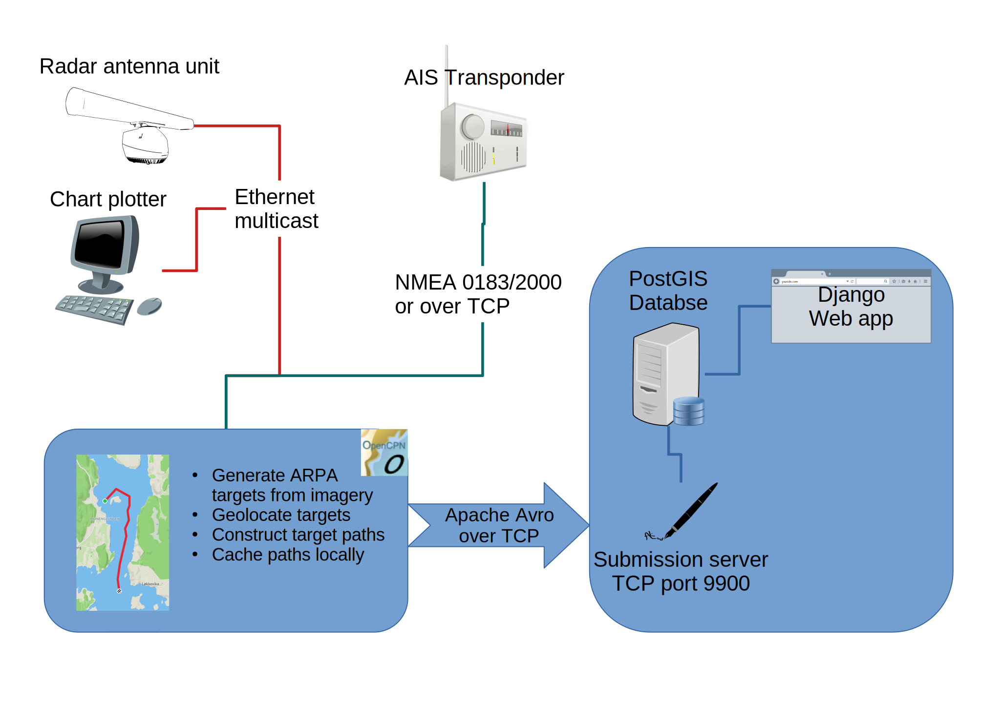

# Technical overview of our platform

The following document describes our on board and cloud systems, and
how they interact with each other and with other on-board systems.

Before we delve into the details, here are some general notes about
the onboard-systems and their security design:

* The on board software **receives data** from various **navigation systems**
  (over NMEA and/or ethernet), but /never sends/ nor produces any data
  to/for them.

  * In the case of NMEA 0183, it is even possible and recommend to
    only connect the RX wires!

* The on board software connects to and **sends data** to our **cloud
  service**, but can not be connected to by, nor receive any data or
  commands from the cloud service.

* All on-board software is **open source** and its functioning can be
  verified by you or third parties

  * We provide a [minimal open source server implementation](https://github.com/KAHU-radar/radarhub-opencpn/tree/master/server) so that all
    on-board software can be tested in isolation (without our cloud).

# On board system

There are currently two possible on-board set-ups, and the choice
depends on whether your radar is one of the [OpenCPN supported
models](https://github.com/opencpn-radar-pi/radar_pi/wiki) or not.

## Alternative one

This set up is for vessels with a [supported
radar](https://github.com/opencpn-radar-pi/radar_pi/wiki).

This solution uses and integrates with [OpenCPN](https://opencpn.org),
an open source chart plotter with a radar plotter plug-in.

OpenCPN is connected to the radar antenna unit via ethernet as well as
to the AIS and heading sensors via NMEA (0183 or 2000 via usb adapter
or over TCP).

Radar imagery is directly received over multicast over ethernet by the
Radar plugin for OpenCPN. The Radar plugin generates ARPA targets.
These are further processed by the [KAHU Radar Hub plugin](https://github.com/KAHU-radar/radarhub-opencpn), which
geolocates the target positions using position and heading information
received via NMEA.

Consecutive locations for the same ARPA target are strung together
into a path, and this path uploaded to our cloud using an efficient
[Apache Avro](https://avro.apache.org/) based [protocol](https://github.com/KAHU-radar/radarhub-opencpn/blob/master/data/proto_avro.json).

If internet is not available, paths are cached locally in an [sqlite database](https://sqlite.org/) until connectivity is restored.

## Alternative two

This setup works for any radar model as long as it can stream ARPA
targets over NMEA ($RATTM messages).

This solution uses and integrates with [Signal K](https://signalk.org/),
an open source on board marine data hub.

Moving radar targets (ARPA targets) are identified by the radar. The
radar sends these over NMEA 0183 or NMEA 2000, either over their
respective standard cabling, or over TCP.

SignalK is connected to the radar NMEA stream as well as heading and
position streams from AIS and heading sensor.

The received ARPA target messages ($RATTM) are processed by the [KAHU
Radar Hub plugin](https://github.com/KAHU-radar/radarhub-signalk), which geolocates the target positions using position
and heading information received via NMEA.

Consecutive locations for the same ARPA target are strung together
into a path, and this path uploaded to our cloud using an efficient
[Apache Avro](https://avro.apache.org/) based [protocol](https://github.com/KAHU-radar/radarhub-opencpn/blob/master/data/proto_avro.json).

If internet is not available, paths are cached locally in an [sqlite database](https://sqlite.org/) until connectivity is restored.

# Cloud platform

Our cloud platform is hosted on Google Compute Engine. It consists of three main components: A [PostGIS database server](https://postgis.net/)
that stores paths and allows for queries against paths, a submission server that the on board systems connect to to deliver paths, and
a [Django](https://www.djangoproject.com/) based web application for user regisration and data access.

Access control for the web application is done using [Django allauth](https://allauth.org/), which provides integration with various OAuth2 providers such as github, google, microsoft etc.

Access control for the submission server is done using API keys.
